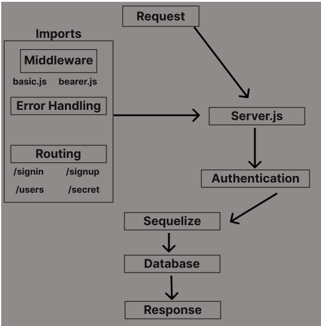

# basic-auth (LAB 07)

## Project: Auth Template

### Author: Tyler Bennett

### Problem Domain  

Bearer Authentication template.

### Links and Resources

- [ci/cd](https://github.com/tyler-bennett52/bearer-auth/actions/new) (GitHub Actions)

### Setup

#### `.env` requirements (where applicable)

DATABASE_URL requires a postgres DB url

#### How to initialize/run your application (where applicable)

- `node index.js`

#### How to use your library (where applicable)

#### Features / Routes

Authentication Server Phase 2: Token (Bearer) Authentication.

Secure JWT tokens by reducing their expiration time to 15 minutes.

#### Tests

fill this in as you see fit

- How do you run tests? -  npm test
- Any tests of note? -  no
- Describe any tests that you did not complete, skipped, etc. -  Undid sessions implementation because I could not get it to play nice with the testing environment.

#### UML

#### Attribution

This was made with starter code
